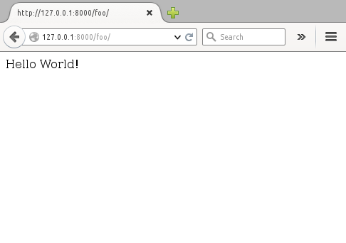

django-easy-app
***************

This is a django app that allows for extending the django url processing to
allow for defining url routing as part of a django Class based view.

Quickstart
==========

Here are some steps for getting things going

Set up a new django project
---------------------------
Create a new python project using the django_easy command like this::

    django_easy startproject project_name app_name

Example::

    $ django_easy startproject foo_project foo_app
    Creating easyapp named: foo_app
    $ tree foo_project
    foo_project
    ├── foo_app
    │   ├── admin.py
    │   ├── __init__.py
    │   ├── migrations
    │   │   └── __init__.py
    │   ├── models.py
    │   ├── tests.py
    │   ├── urls.py
    │   └── views.py
    ├── foo_project
    │   ├── __init__.py
    │   ├── __init__.pyc
    │   ├── settings.py
    │   ├── settings.pyc
    │   ├── urls.py
    │   └── wsgi.py
    └── manage.py

    3 directories, 14 files

Create views
------------
In the views.py file define a variable named "easydjango" and set the value
to true.

Make sure each view that should be accessible from the web has a `*route*`
attribute that contains the part of the url that should be associated with the
view.  This should not include any other part of the url.

So for example foo_app.view.ExampleView below has a route value of '' which
will cause it to be accessible at http://hostname:port/foo_app/

.. code-block:: python

    from django.http import HttpResponse
    from django.views.generic import View

    easydjango = True

    class NameView(View):
        route = ''
        def get(self, request):
            name = request.GET.get('name', 'World!')
            return HttpResponse('Hello %s' % name)

